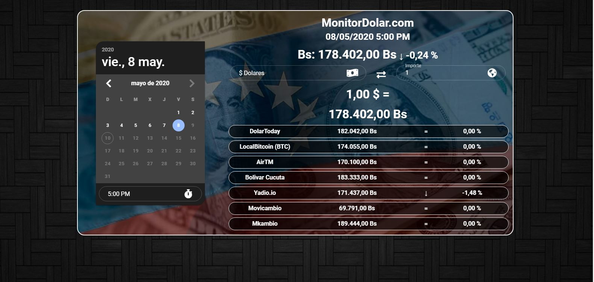

# Dolar Time

_Aplicación web para saber el precio del dolar en Venezuela así como también el porcentaje del aumento del mismo según la fecha en su defecto con el día anterior, así mismo tiene integrada una calculadora de Bolivares a Dolares y viceversa. Los datos son traidos por medio de una api de monitordolar.com por lo que no son fiables por el momento._

## * [Demo](https://dolartime-23d80.web.app/)  🚀

#Screenshot



## Comenzando 🚀

_Estas instrucciones te permitirán obtener una copia del proyecto en funcionamiento en tu máquina local para propósitos de desarrollo y pruebas._

Mira **Deployment** para conocer como desplegar el proyecto.

### Instalación 🔧

_Una serie de ejemplos paso a paso que te dice lo que debes ejecutar para tener un entorno de desarrollo ejecutandose_


```
npm install
```

### Compila y recarga en caliente para el desarrollo
```
npm run serve
```

### Compila y minimiza para produccion
```
npm run build
```


## Despliegue 📦

_Para realizar deply en firebase cree la app e inegrela al codigo luego ejecute_
```
frirebase init
```
_Y por ultimo_
```
frirebase deploy
```

## Construido con 🛠️

* [Vuejs](https://vuejs.org/index.html) - El framework web usado
* [npm](https://www.npmjs.com/) - Manejador de dependencias
* [Vuetify](https://vuetifyjs.com/) - Biblioteca de Vue UI con componentes de materiales desing
* [Vue-Axios](https://www.npmjs.com/package/vue-axios) - Consumidor de Api
* [Vue-Router](https://router.vuejs.org/) - El router oficial Vue.js
* [Vuex](https://rometools.github.io/rome/) - Patrón de gestión de estado + biblioteca para aplicaciones Vue.js. Sirve como una tienda centralizada para todos los componentes de una aplicación

## Autores ✒️

* **Luis Alfonso Alarcon** - *Creador* - [alfonso2254](https://gist.github.com/alfonso2254)

## Licencia 📄

Este proyecto está bajo la Licencia  [MIT](https://opensource.org/licenses/MIT) 

## Expresiones de Gratitud 🎁

* Gracias a Vanessa mi novia por estar conmigo durante la creacios de este proyecto aportando ideas y atenderme con el cafe todos los dias 📢
* Gracias a la familia Briceño - Vasquez por atenderme mientras creaba este proyecto 🤓.


---
⌨️ Con ❤️ por [Luis Alarcon](https://gist.github.com/alfonso2254) 😊
